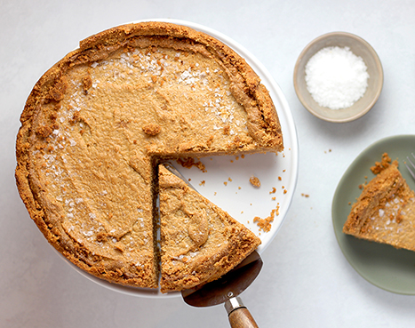

# Pie Charts



The `ggpie` package allows you to easily create pie charts using `ggplot2`. Both
single and faceted pie charts can be created.


To download this package use the following code:

```
if(!require(devtools)){
   install.packages("devtools")
}
devtools::install_github("rkabacoff/ggpie")
```
